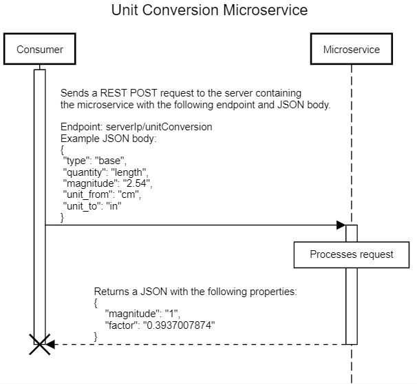

# Unit Conversion API

This API allows for unit conversions to be made with the provided parameters.

## Endpoint
- Make a `POST` REST API request to the follow address.
    - `serverIp/unitConversion`

## Parameters
- `type`: Whether the unit is a base unit (e.g., length is in meters in the SI system) or a derived unit.
- `quantity`: What is being measured (e.g, time, length, mass, etc.).
- `magnitude`: The magnitude of the unit the user wants to convert from.
- `unit_from`: The unit the value is currently in.
- `unit_to`: The unit to convert the value to.

    ```json
    {
    "type": "base",
    "quantity": "length", 
    "magnitude": "2.54",
    "unit_from": "cm",
    "unit_to": "in"
    }
    ```

## Response
- `Response`: A `JSON` containing the converted magnitude and the conversion factor used.
    
    ```json
    {
    "magnitude": "1",
    "factor": "0.3937007874"
    }
    ```

## UML Sequence Diagram



<!-- title Unit Conversion Microservice
participant Consumer
participant Microservice

activate Consumer
Consumer->Microservice:Sends a REST POST request to the server containing\nthe microservice with the following endpoint and JSON body.\n\nEndpoint: serverIp/unitConversion\nExample JSON body:\n{\n "type": "base",\n "quantity": "length", \n "magnitude": "2.54",\n "unit_from": "cm",\n "unit_to": "in"\n}
activate Microservice
box over Microservice:Processes request
Microservice-(Remove me)->Consumer:Returns a JSON with the following properties:\n{\n    "magnitude": "1",\n    "factor": "0.3937007874"\n}
deactivate Microservice
deactivate Consumer
destroy Consumer -->